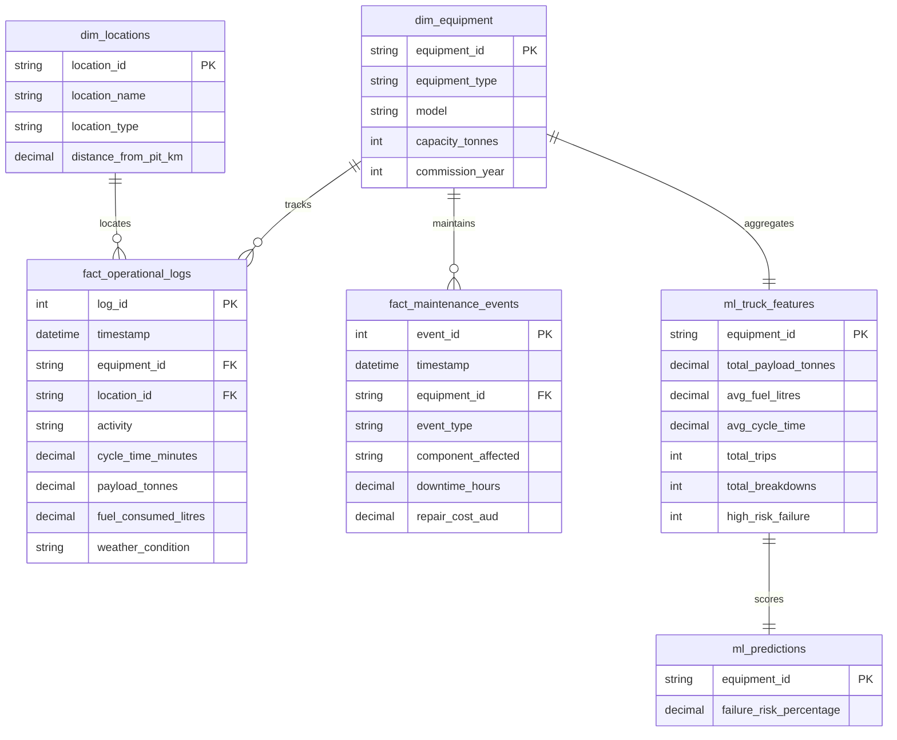

# 🇦🇺 Australian Mining Operations Digital Twin & Predictive Management Suite

An end-to-end digital twin simulation and data analytics platform designed to model a discrete-event **Pit-to-Port Iron Ore supply chain network** in Western Australia's Pilbara region. 

The platform bridges the gap between raw industrial machine telemetry and executive-level corporate strategy by replicating real-world mining constraints, calculating asset performance, and utilizing advanced predictive modeling to eliminate unscheduled operational downtime.

---

## 🏗️ Project Architecture

The platform is engineered as a multi-stage enterprise data pipeline:

1. **Simulation Engine (Python):** A stochastic, discrete-event simulation model (`run_simulation.py`) that generates continuous time-series telemetry logs. It injects complex variables including randomized cycle times, payload distributions, weather anomalies (light/heavy rain delays), and asset-age-based mechanical breakdown risks.
2. **Data Warehouse (SQL):** A structured SQLite database designed using an optimized **Star Schema** to enable high-performance analytical querying. The warehouse separates static dimensions (`dim_equipment`, `dim_locations`) from granular operational and maintenance event datasets (`fact_operational_logs`, `fact_maintenance_events`).
3. **Automated Feature Engineering:** A data pipeline module (`ml_feature_engineering.py`) that handles rolling historical data aggregations, parsing telemetry streams into multi-dimensional asset behavior profiles (`ml_truck_features`).
4. **Predictive Analytics Engine (Machine Learning):** A `scikit-learn` workflow (`ml_train_model.py`) utilizing a **Random Forest Classifier** that evaluates real-time engineering stress metrics against custom commercial cost thresholds to forecast failure probabilities.
5. **Interactive Control Tower UI:** A high-density management dashboard built using **Streamlit** and **Plotly Engine**, granting operators live visibility into real-time yield curves, climate disruptions, economic leakage, and predictive machine health rankings.

---

## 🚀 Technical Stack

* **Programming Language:** Python 3.x
* **Database Engine:** SQLite / SQL Data Warehousing
* **Data Modeling:** Star Schema (Fact & Dimension Tables)
* **Machine Learning Framework:** Scikit-Learn (Random Forest)
* **Application Framework:** Streamlit UI
* **Data Visualization:** Plotly Express Engine

---

## 📊 Database Schema Blueprint

The data warehouse uses the following core relational structure:

* **`dim_equipment`**: Tracks fleet assets (Haul Trucks and Excavators), capacities, models, and commission years.
* **`dim_locations`**: Captures mining network coordinates, types (Pits, Stockpiles, Crushers), and transit distances.
* **`fact_operational_logs`**: Captures real-time streaming telemetry records for loading, hauling, dumping, and empty return activities.
* **`fact_maintenance_events`**: Records unexpected breakdown events, component failures, repair durations, and associated maintenance costs (AUD).
* **`ml_truck_features`**: Engineered dataset tracking aggregated fleet metrics (total payloads, average fuel burn, cycle lag, and historical failure counts).
* **`ml_predictions`**: Final model output ledger storing localized asset failure probability scores.
* **`ml_feature_importance`**: Diagnostic weights map documenting model rationale parameters.

---

## 📊 Relational Database Schema (ERD)



---

## 📈 Target Key Performance Indicators (KPIs)

The database schema is engineered specifically to calculate the following target enterprise metrics:

* **OEE (Overall Equipment Effectiveness):** Measuring fleet availability (uptime vs downtime), performance efficiency (cycle times vs benchmarks), and quality throughput (actual total tons delivered).
* **Payload Variance:** Tracking haul truck under-loading or over-loading patterns against maximum rated physical capacities to optimize structural wear-and-tear vs throughput.
* **Mean Time To Repair (MTTR):** Evaluating maintenance responsiveness, engineering execution efficiency, and mean breakdown durations categorized by component type (Engine, Tyres, Hydraulics, Drivetrain).
* **Fuel Efficiency Metrics:** Analyzing average litres burned per hauled tonne (`Fuel / Tonne`) across specific routes and weather variations to identify high-cost haul segments and optimize carbon metrics.
* **Revenue Leakage Audit:** Translating mechanical downtime intervals directly into financial opportunity loss metrics (modeled at a standard regional cost of $3,500.00 AUD per machine-hour).

---

## 🔮 Machine Learning & Explainable AI (XAI)

Rather than acting as an uninterpretable "black box," the predictive framework includes an integrated **Explainable AI (XAI)** data layer.

By exposing the Random Forest model's underlying `feature_importances_`, the control room surfaces exactly *why* a haul truck has been assigned a high risk rating. For instance, the system isolates that **Total Historical Breakdowns** accounts for 42% of the predictive attribution weight, followed by **Engine Fuel Burn Strain** at 28%. This allows fleet dispatchers to coordinate preventative maintenance pathways before critical catastrophic failure points are reached.

---

## 🛠️ Execution Instructions

Navigate to your local workspace path and execute the scripts in order to spin up the data infrastructure pipeline:

1. **Initialize Warehouse & Populate Logs:**
```bash
python3 run_simulation.py

```


2. **Process Feature Engineering Pipelines:**
```bash
python3 ml_feature_engineering.py

```


3. **Train Random Forest Predictive Model:**
```bash
python3 ml_train_model.py

```


4. **Boot Up the Dashboard Tower:**
```bash
streamlit run app.py

```
---
## 📁 Repository Structure

Below is the layout of the project workspace directory:
```text
mining_digital_twin/
├── .gitignore                  # Production file filter (excludes DB and cache)
├── EXECUTIVE_REPORT.md         # Strategic executive summary of key findings and analytical solutions
├── README.md                   # Enterprise-grade documentation & KPI blueprint
├── analytical_views.sql        # Specialized SQL scripts executing analytical star-schema queries
├── app.py                      # Main Streamlit control tower interactive UI dashboard
├── ml_feature_engineering.py   # Aggregation pipeline transforming telemetry into ML feature stores
├── ml_train_model.py           # Random Forest training script generating predictive XAI weights
├── run_simulation.py           # Stochastic simulation generator for raw operational logs
└── sample_telemetry_logs.csv   # Baseline static sample dataset for telemetry validation
```
---

## 👷 Author & Developer Portfolio

* **Developer:** Durgka Asokan
* **Role:** Information Technology / Data Engineering Graduate
* **Location:** Melbourne, VIC, Australia
* **Project Scope:** Local Enterprise Sandbox Prototype
* **Connect:** [LinkedIn](https://www.linkedin.com/) | [GitHub](https://github.com/durgkaasokan)

```

```
